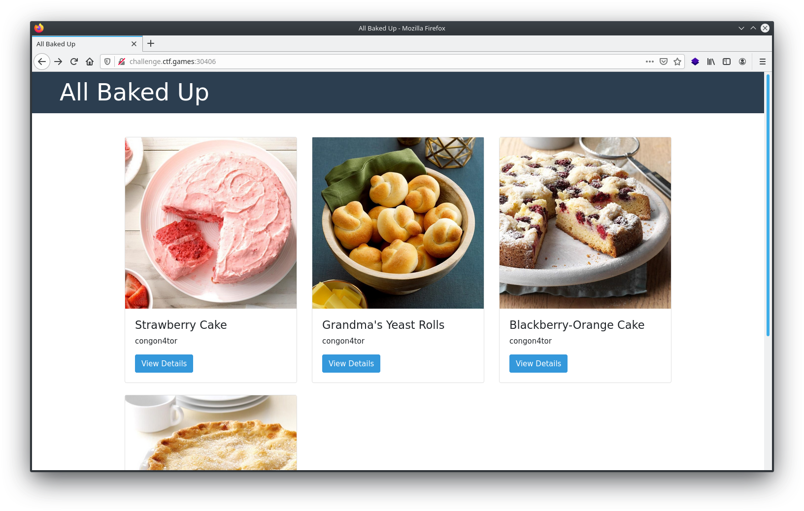
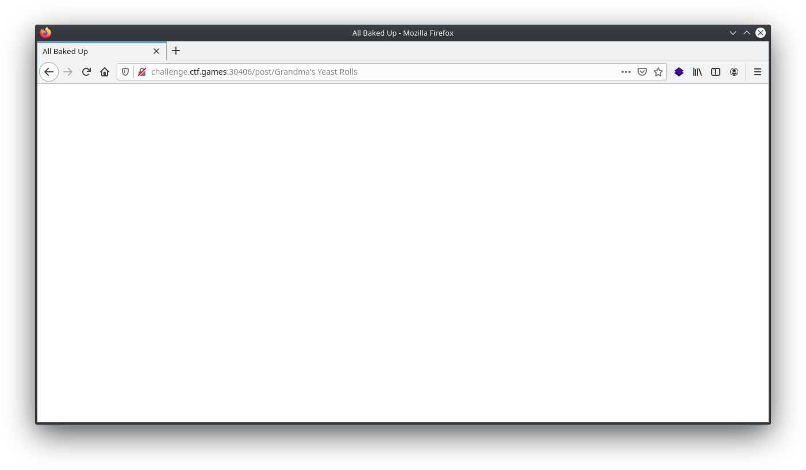
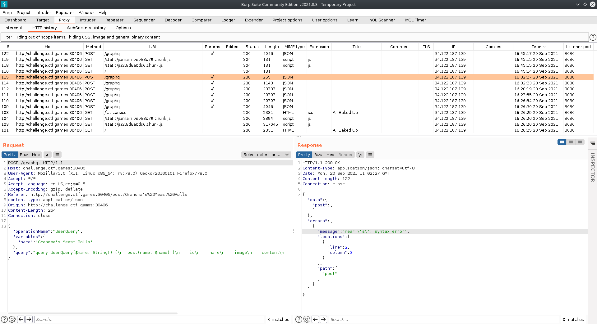
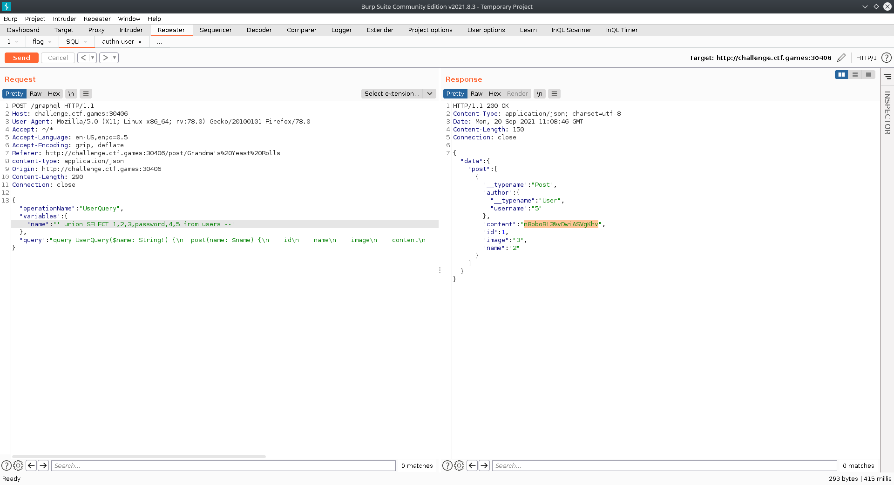
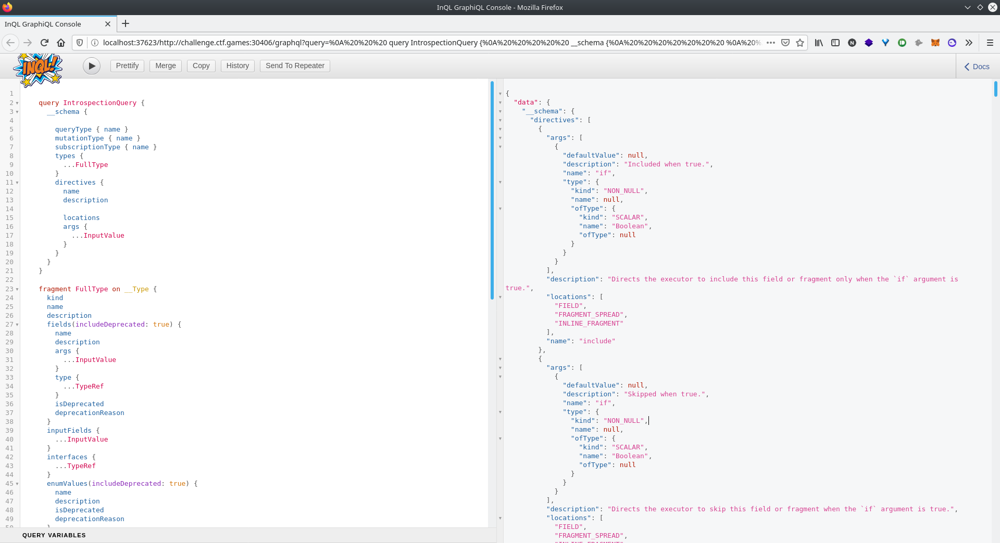
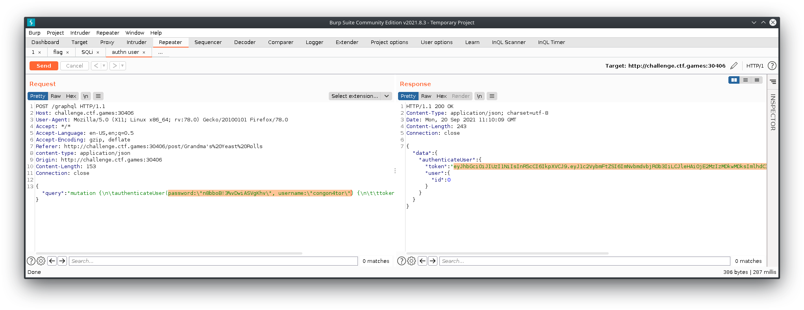
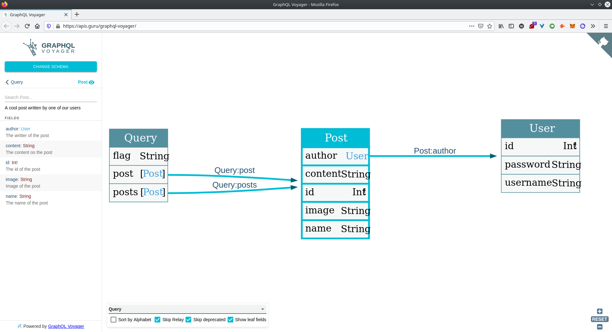
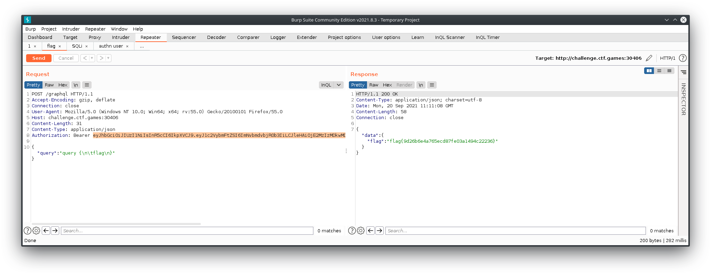

I discovered GraphQL while building this personal website with Gatsby. And decided to attempt the "All Baked Up" challenge that was using GraphQL. It was the only challenge I managed to solve, and it was a medium. I have not yet gotten to writing the full article and may never will. But here are the screenshots, you can fill in the rest with your imagination. 

---

