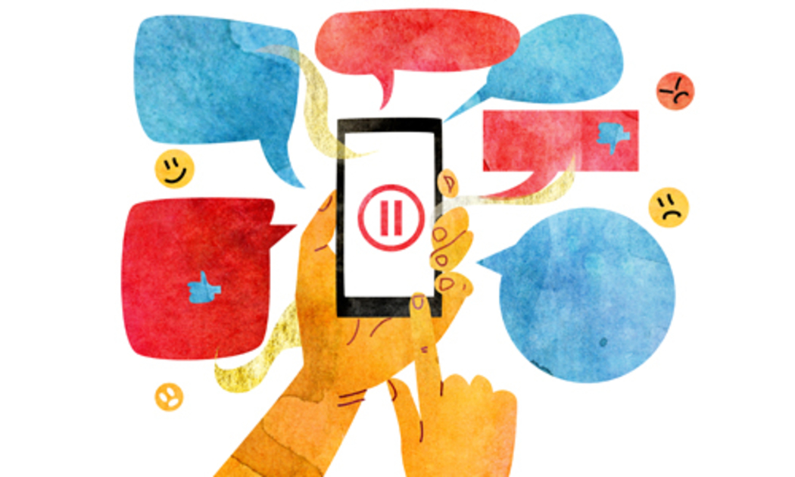

A curated list of resources about the attention economy & how companies profit from manipulating our attention. Also how to use social media to your benefit. Read along so you, too, can rebel against the Empire.

There are enormous amounts of information(read: distractions) all around you, vying for your attention. And yet you chose to click on this article... or did you?

## The Algorithm

Whenever you interact with posts, watching, liking, commenting, sharing, the algorithm gets to know your preferences, the algorithm then finds and shows you relevant content which it thinks you might enjoy as well, thus keeping you engaged.

You might have have realized this on your own and yet we continue to do it again. WHY?! 

Human Psychology. 

Our brain’s constant need for newer stimulation. Which the algorithm presents to us in the form of new posts & notifications. And when we're constantly presented with new information, dopamine is released - you know, the brain's way of rewarding itself for seeing a dope meme, subconsciously sending us down a rabbit hole where we end up spending much more attention than needed.

> But, how do these platforms make money from our attention, you ask?

---

## The Dark Side

These platforms track your every interaction while you’re on them, the times you're active, the amount of time you spend on a post, and similar content, watched, tracked, measured and used to not only predict what you might like but what you might want, which is how you get **Targeted Ads**. Money is paid to these platforms by the owners of such products and services to show us these ads, which they later get back from us when we buy stuff from them.

> That doesn’t seem so dark.

It doesn’t but the unethical ways these platforms are using to manipulate our behavior is highly discomforting. The Social Dilemma, gives an insightful view of social media by the people who once helped establish and perpetuate the current habits of the internet across the globe. A documentary I recommend(not the Netflix algorithm) everyone must watch.

https://www.netflix.com/in/title/81254224

All those personal preferences collected by the platforms are used to construct a sense of the world around wherein everyone agrees with you. The confirmation bias works in reverse here. Attracting you into a virtual comfort-zone where nothing opposes your world view… which is why you’ll want to spend more of your time and attention there. But this pushes your slightly opinionated thoughts, little by little, to extreme ends, programming you on a deeper level so you are more likely to act as if it were your own volition.

https://www.theguardian.com/news/series/cambridge-analytica-files

The underlying game is different here, our susceptibility to various psychological biases is abused by companies, priming our thoughts and behavior. It is a marketplace that trades exclusively in human futures. And it is this mix of how platforms use the algorithm and the psychology of our minds that has made this game invisible.

https://www.nytimes.com/2020/01/24/opinion/sunday/surveillance-capitalism.html

> So should I stop using all these products and services and boycott everything?

---

## Engage, but not as asked

Now that you know how the algorithms work, you see the sole purpose of it is keep you on the platform for as long as possible by showing you content based on your preferences.

But you can train it to get the content that you want. Because, you always have the choice of what content to engage with, you can actively choose something that helps you build up any skill & gain knowledge rather than passive entertainment. And if you do it right, the algorithm will help you. Overtime, you’ll see that you are presented with valuable content without having to manually look for it, reducing your efforts in the long run.

There are amazing amount of stuff I have discovered through this process that I wouldn’t have otherwise… the "Guvi, Harvard and Google Cloud Platform free courses" posts on Instagram would be my most recent example. All of the tech & financial news articles I get in my Google Now feed as a result of researching topics during college is another. I find learning about the latest in these domains so effortless as just swiping right. Yeah, it's like Tinder where you match with valuable content(unless you're NOT constantly searching for ).

Also exposing yourself to thoughts with an opposing worldview to yours, which presents perspectives outside your comfort zone, basically stuff that you might not agree with. This would help you develop a balanced mindset and prevent you from always consuming skewed information that fuels extreme opinionated thoughts.

Even manually switching to view the latest posts(instead of top or trending) on every platform will get you content from different perspectives instead of only getting the top posts which would be the similar on all platforms.

https://www.audible.in/pd/How-to-Do-Nothing-Audiobook/1528873882

https://www.audible.in/pd/Nudge-Audiobook/B079TLFQ61

How to Do Nothing and Nudge are two books that have helped me understand the attention economy and subconscious ways by which companies influence our decisions on education, personal finance, family, health care, mortgages and credit cards, and even the planet itself. And through which you can develop a broader understanding of the same.

But possibly the best thing to do, is to physically separate yourself from this virtual world and get out into reality every now and then, connect with others in person, take a walk amidst the beauty of nature, what did people do before the advent of social media consumed us all?

Now before ending this article I'll leave you with thought... there are nearly endless opportunities to improve each day and finding them largely boils down to being curious. Be aware of the fact that you have the choice to decide what you pay attention to. So the next time you watch the recommended video on auto-play, or respond to that notification from your friend... pause to consider this… are you the one choosing to do that? or is it some algorithm?

This is how you begin to take control of the algorithms that run the world, and use them to your benefit rather than algorithms telling you what to do.
