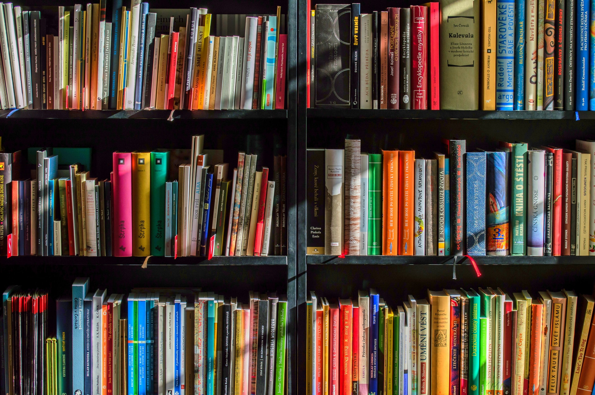

---

### 📖 THE 4-HOUR WORKWEEK 
started reading this in January 2021 - Tim Ferris talks about designing a new lifestyle for yourself where you have more control over your time, location & options - **Defining** your ideal life - **Eliminating** what does not benefit you - **Automating** everything you have more time & energy to do things YOU want - **Liberating** yourself from anything that binds you to things or location - this is quite literally a step-by-step guide - originally published in 2007 AND still relevant - this book completely changed what & how i do things in life now

---
 
### 📖 RANGE
lots of analogies, lots of stories about some very successful people & companies across disciplines & time - like Van Gogh, he only started painting at the age of 33 OR the way Netflix interprets human complexities to vastly improve their recommendation algorithms OR Kepler using analogies to create the most accurate model of the solar system - point being you don't need to rush to become the best in a field, you can be good in a few different fields and make that your unique selling point - instead of being a specialist, **be a generalist!** - making use your creativity & learning to move across disciplines and define your meaning of achievement 

---

### 📖 RICH DAD POOR DAD
2 things that changed my perspective 

1. schools & colleges brainwash you with “if you dont study hard and get a degree you won't survive in this world” - the reason they dont teach money is to keep you in the wage slave trap - if you think i’m using strong words there, just read the book - the author does a way better job

2. rich people don't own anything - they use debt to fund their lifestyle, reduce their taxes & create generational wealth

---

### 📖 BLINKIST 
not book but an app - gives **key ideas about one full length book everyday** - takes **15 20 minutes** to finish - definitely NOT an alternative to full length books, but i just finished my 200th blink on this, which means 200 new ideas that i didn't have to actively search for - all for free and you should definitely give it a try - topics ranging from science, environment & history, money & motivation & health - topics that you're generally interested in, but also topics that you might never pick a book about - listen to this for 20 minutes everyday, get 365 new ideas delivered to you in a year - to get a broader understanding of the world, how everything connects to everything else, there are things that we never actively try to research on, bcoz several reasons, but they still affects us in ways that aren't obvious - and if i were to sum it up - gaining knowledge about different fields is what helps you broaden your worldview, to get a **deeper understanding of the world** - also using this app fits perfectly with ideas discussed in Range by David Epstein 

---

### 📖 FREAKONOMICS
definitely opened my mind about how even the smallest insignificant thing might influence economic situations - how people behave differently when incentives change in a situation - how looking at the same data from different perspectives, more importantly considering the context can help understand those long term trends of society - **the swimming pool is about 100 times more likely to kill a child than the gun is** - this book is funny, and i legit Laughed Out Loud at some parts while listening to it in parks and metros while people think i'm a psychopath

---

### 📖 CHANAKYA NEETI 
**indian teacher & philosopher** - this book contains original thoughts written by Chanakya on a variety of topics, individuals, society, friends & general observations on management, & leadership - BUT i just have one issue with this, the author has wrote some bad things about the nature of women which are simply not true, so ignore all of that - BUT bcoz this was written in a simpler time, it **cuts through all the noise of the modern world delivers ideas straight**, and surprisingly many are still relevant to this day - fascinating insights like, learning from the behaviour of plats and animals around us, hardworking ants day and night for instance

---

### 📖 OWN YOUR WEIRD
no "shoulds" guide your life, let go of "supposed to" thoughts - why not do things in YOUR unique style - **YOUR terms** - break out of the blueprint - hone your unique skills, you've got nothing to lose - **show your weird to the world** - throw out the conventional wisdom of doing things the right way - for there is not one - but far too many

---
