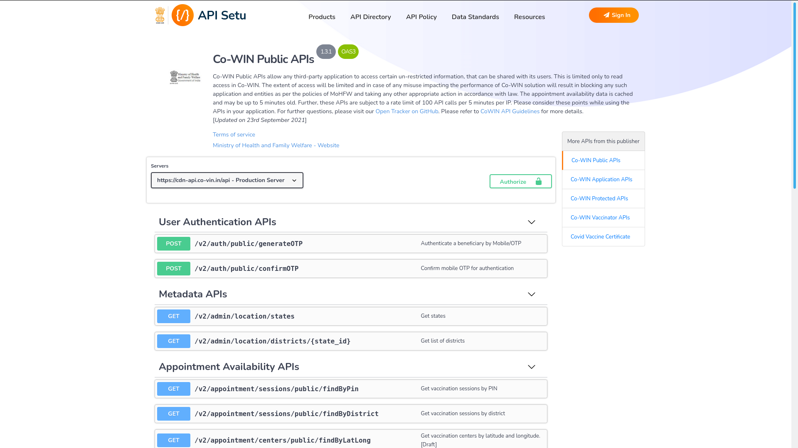
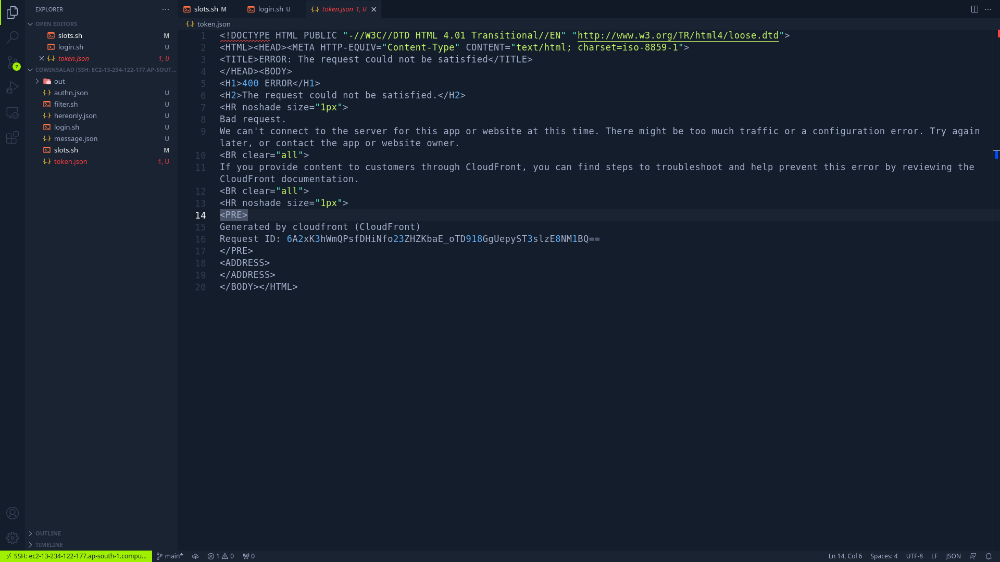
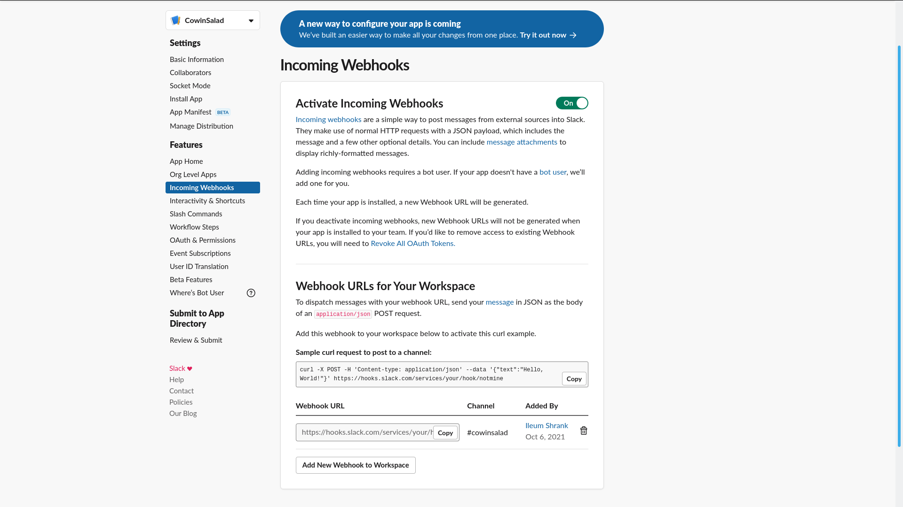
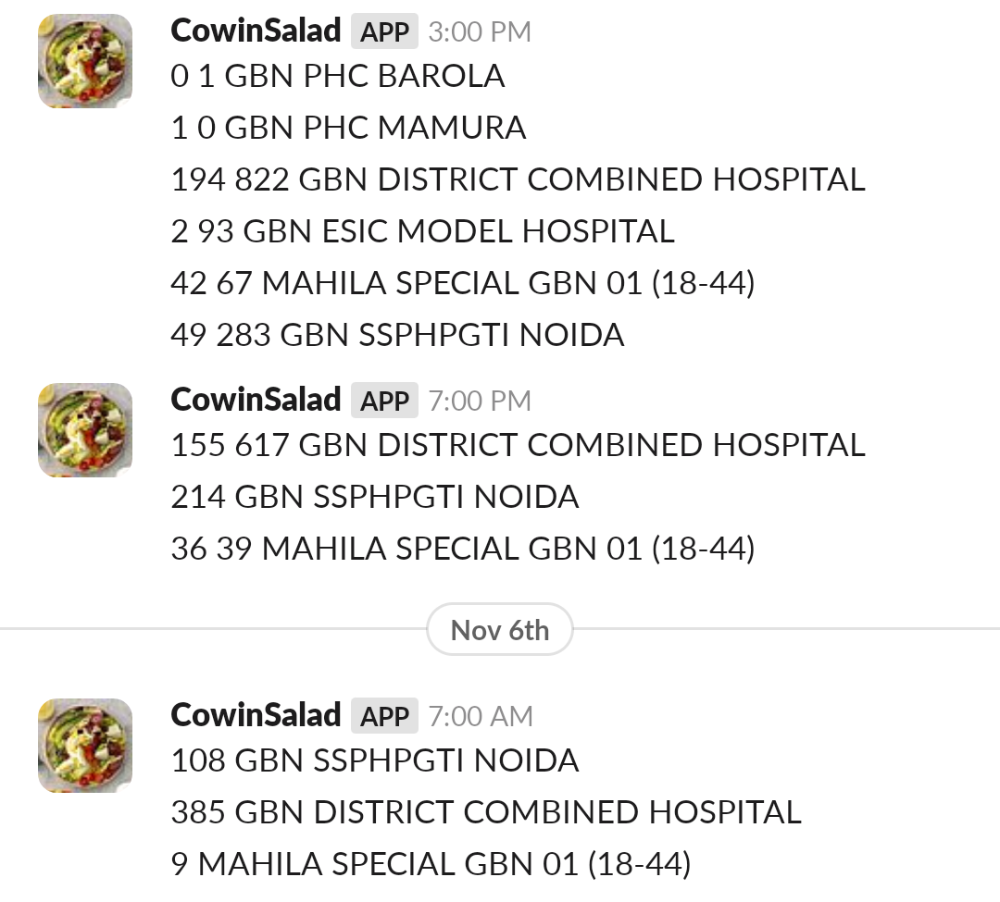

---
**October 2 the day of initiation:** I opened the CoWIN website to look for vaccination slots. My brother told me before that it would take me weeks to get a slot; I had to look at it everyday for hours to understand how & when slots were released. and then login at the right time to get an available slot before evrything gets booked. But as you might figure, I am not a big fan of mundane repetitive labor, because using my hands to do any kind of boring task would potentially break my beautiful nails so that was out of the question. there was only one thing left for me... programming a bot to do my work.



The CoWIN APIs were released quite a while ago and i got the chance to play around with it. But now bcoz of the vaccine shortage, the slots are scarce especially for the first dose, also i need some very specific filters that are not available on other platforms. basically, getting notified on SLACK whenever dose1 is available at a centre that is 15-20 minutes away. 

these APIs, they come in both public & protected(authenticated) verisons on test & production servers with rate limiting of 20 requests in 15 minutes. I used the protected version on the production server at first, thinking it would give me more accurate response. but i realized this was not true.



after spending 4 days trying to understand why my login request was blocked by CloudFront, i gave up. and discovered the public version gave the exact same results & quickly switched to that.

i used `curl` to request `/calendarByDistrict` endpoint for available vaccination slots in my district. this takes 2 inputs: 
- **district_id** - the quickest way to find this is to use dev tools. on the [original website](https://selfregistration.cowin.gov.in/) input your state & district and to get the slots, and check the request made in the network tab. the request URL will contain the district_id parameter value 
- **date** - the date needs to be updated dynamically since we need it running everyday, so i used the date command, specified the time zone(this is necessary bcoz i am running it on the same AWS server which is set to UTC. i do not want to change the server timings since the script to update [TheDailyBlink](https://thedailyblink.ml/) is also running on the same server and i don't want that affected)

but since i'm too lazy to type the whole thing by hand, i'll just Right Click > Copy > Copy as cURL to save time, and the mental resources to write the necessary headers. also i can clean the headers but i'm working on getting things done faster and spend less time perfecting it(as oppossed to a younger version of myself). 

```bash
curl -s "https://cdn-api.co-vin.in/api/v2/appointment/sessions/public/calendarByDistrict?district_id=650&date='"$(TZ="Asia/Kolkata" date '+%d-%m-%Y')"'" \
    -H 'User-Agent: Mozilla/5.0 (Windows NT 10.0; Win64; x64; rv:91.0) Gecko/20100101 Firefox/91.0' \
    -H 'Accept: application/json, text/plain, */*' -H 'Accept-Language: en-US,en;q=0.5' --compressed -H 'Origin: https://www.cowin.gov.in' \
    -H 'Connection: keep-alive' -H 'Referer: https://www.cowin.gov.in/' -H 'Sec-Fetch-Dest: empty' -H 'Sec-Fetch-Mode: cors' -H 'Sec-Fetch-Site: cross-site' \
    -H 'If-None-Match: W/"c814-j9lr8tf0dp82O8Oy0UxJz4n3gEs"' -H 'TE: trailers'
```

now that i have the request command, querying it gives me lots of JSON i need to filter through and find the slots to my preference. `jq` can help with that so i'll start by filtering the slots which are for my age group(18-44) and Free. also Covishield bcoz the other one isn't WHO-approved or so i have been told.

```bash {6}
curl -s "https://cdn-api.co-vin.in/api/v2/appointment/sessions/public/calendarByDistrict?district_id=650&date='"$(TZ="Asia/Kolkata" date '+%d-%m-%Y')"'" \
    -H 'User-Agent: Mozilla/5.0 (Windows NT 10.0; Win64; x64; rv:91.0) Gecko/20100101 Firefox/91.0' \
    -H 'Accept: application/json, text/plain, */*' -H 'Accept-Language: en-US,en;q=0.5' --compressed -H 'Origin: https://www.cowin.gov.in' \
    -H 'Connection: keep-alive' -H 'Referer: https://www.cowin.gov.in/' -H 'Sec-Fetch-Dest: empty' -H 'Sec-Fetch-Mode: cors' -H 'Sec-Fetch-Site: cross-site' \
    -H 'If-None-Match: W/"c814-j9lr8tf0dp82O8Oy0UxJz4n3gEs"' -H 'TE: trailers' | 
    jq -r '.centers[] | select(.fee_type == "Free") | select(.sessions[].min_age_limit == 18) | select(.sessions[].vaccine == "COVISHIELD") 
```

now onto the most important filter which no platform is offering, selecting list of centres which i'm willing to go to, OR are nearer to my home. your reason could be anything. 

```bash {7-15}
curl -s "https://cdn-api.co-vin.in/api/v2/appointment/sessions/public/calendarByDistrict?district_id=650&date='"$(TZ="Asia/Kolkata" date '+%d-%m-%Y')"'" \
    -H 'User-Agent: Mozilla/5.0 (Windows NT 10.0; Win64; x64; rv:91.0) Gecko/20100101 Firefox/91.0' \
    -H 'Accept: application/json, text/plain, */*' -H 'Accept-Language: en-US,en;q=0.5' --compressed -H 'Origin: https://www.cowin.gov.in' \
    -H 'Connection: keep-alive' -H 'Referer: https://www.cowin.gov.in/' -H 'Sec-Fetch-Dest: empty' -H 'Sec-Fetch-Mode: cors' -H 'Sec-Fetch-Site: cross-site' \
    -H 'If-None-Match: W/"c814-j9lr8tf0dp82O8Oy0UxJz4n3gEs"' -H 'TE: trailers' | 
    jq -r '.centers[] | select(.fee_type == "Free") | select(.sessions[].min_age_limit == 18) | select(.sessions[].vaccine == "COVISHIELD") 
    | select(.name == "GBN DISTRICT COMBINED HOSPITAL" 
    or .name == "GBN ESIC MODEL HOSPITAL" 
    or .name == "GBN GIP MALL COVISHIELD" 
    or .name == "GBN PHC BAROLA" 
    or .name == "GBN PHC MAMURA" 
    or .name == "GBN SSPHPGTI NOIDA" 
    or .name == "MAHILA SPECIAL GBN 01 (18-44)" 
    or .name == "GBN UPHC RAIPUR" 
    or .name == "GBN SPECTRUM METRO MALL")
```

also i'll put a filter for dose1 for these nearby hospitals, and some text formatting so that i get number of available slots with the centre name in one line:

```bash {16,17}
curl -s "https://cdn-api.co-vin.in/api/v2/appointment/sessions/public/calendarByDistrict?district_id=650&date='"$(TZ="Asia/Kolkata" date '+%d-%m-%Y')"'" \
    -H 'User-Agent: Mozilla/5.0 (Windows NT 10.0; Win64; x64; rv:91.0) Gecko/20100101 Firefox/91.0' \
    -H 'Accept: application/json, text/plain, */*' -H 'Accept-Language: en-US,en;q=0.5' --compressed -H 'Origin: https://www.cowin.gov.in' \
    -H 'Connection: keep-alive' -H 'Referer: https://www.cowin.gov.in/' -H 'Sec-Fetch-Dest: empty' -H 'Sec-Fetch-Mode: cors' -H 'Sec-Fetch-Site: cross-site' \
    -H 'If-None-Match: W/"c814-j9lr8tf0dp82O8Oy0UxJz4n3gEs"' -H 'TE: trailers' | 
    jq -r '.centers[] | select(.fee_type == "Free") | select(.sessions[].min_age_limit == 18) | select(.sessions[].vaccine == "COVISHIELD") 
    | select(.name == "GBN DISTRICT COMBINED HOSPITAL" 
    or .name == "GBN ESIC MODEL HOSPITAL" 
    or .name == "GBN GIP MALL COVISHIELD" 
    or .name == "GBN PHC BAROLA" 
    or .name == "GBN PHC MAMURA" 
    or .name == "GBN SSPHPGTI NOIDA" 
    or .name == "MAHILA SPECIAL GBN 01 (18-44)" 
    or .name == "GBN UPHC RAIPUR" 
    or .name == "GBN SPECTRUM METRO MALL") 
    | select(.sessions[].available_capacity_dose1 > 0) 
    | [(.sessions[].available_capacity_dose1|tostring), .name] | join(" ")' | sort -u)
```

and now to get notified whenever these actually useful slots are available, i made a slack bot with incoming webhooks functionality [following this blog](https://www.cloudsavvyit.com/289/how-to-send-a-message-to-slack-from-a-bash-script/), and


```bash {1,23}
SLACK_WEBHOOK_URL="https://hooks.slack.com/services/your/hook/notmine"

# filter API response for nearby slots
SLOTS=$(curl -s "https://cdn-api.co-vin.in/api/v2/appointment/sessions/public/calendarByDistrict?district_id=650&date='"$(TZ="Asia/Kolkata" date '+%d-%m-%Y')"'" \
    -H 'User-Agent: Mozilla/5.0 (Windows NT 10.0; Win64; x64; rv:91.0) Gecko/20100101 Firefox/91.0' \
    -H 'Accept: application/json, text/plain, */*' -H 'Accept-Language: en-US,en;q=0.5' --compressed -H 'Origin: https://www.cowin.gov.in' \
    -H 'Connection: keep-alive' -H 'Referer: https://www.cowin.gov.in/' -H 'Sec-Fetch-Dest: empty' -H 'Sec-Fetch-Mode: cors' -H 'Sec-Fetch-Site: cross-site' \
    -H 'If-None-Match: W/"c814-j9lr8tf0dp82O8Oy0UxJz4n3gEs"' -H 'TE: trailers' | 
    jq -r '.centers[] | select(.fee_type == "Free") | select(.sessions[].min_age_limit == 18) | select(.sessions[].vaccine == "COVISHIELD") 
    | select(.name == "GBN DISTRICT COMBINED HOSPITAL" 
    or .name == "GBN ESIC MODEL HOSPITAL" 
    or .name == "GBN GIP MALL COVISHIELD" 
    or .name == "GBN PHC BAROLA" 
    or .name == "GBN PHC MAMURA" 
    or .name == "GBN SSPHPGTI NOIDA" 
    or .name == "MAHILA SPECIAL GBN 01 (18-44)" 
    or .name == "GBN UPHC RAIPUR" 
    or .name == "GBN SPECTRUM METRO MALL") 
    | select(.sessions[].available_capacity_dose1 > 0) 
    | [(.sessions[].available_capacity_dose1|tostring), .name] | join(" ")' | sort -u)

# send messsages on SLACK
curl -X POST -H 'Content-type: application/json' --data '{"text":"'"$SLOTS"'"}' $SLACK_WEBHOOK_URL
```

made adjustments so each time i query the API the filtered response gets stored in a bash variable and is sent as a text message to my new slack channel #cowinsalad. et voilà! und da ist es! a ma laila nō!



also to automate querying the API, i setup a cronjob so this script runs every few hours and sneds me the available slots for that time

```noLineNumbers
30 1,5,9,13 * * * bash cowinsalad/slots.sh
``` 
