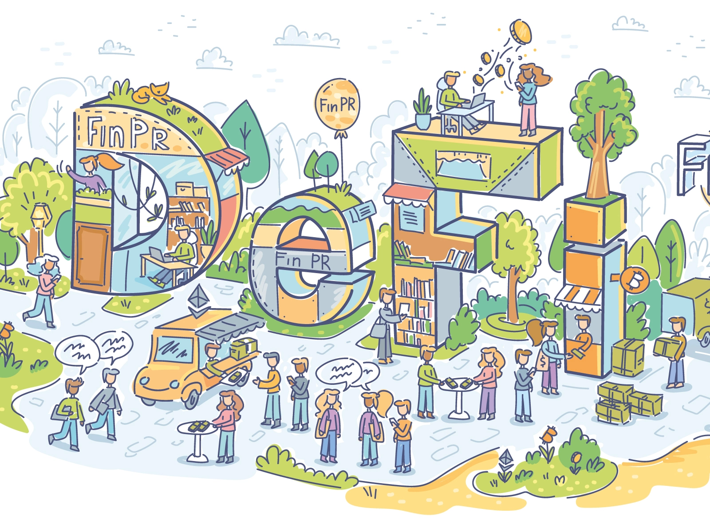
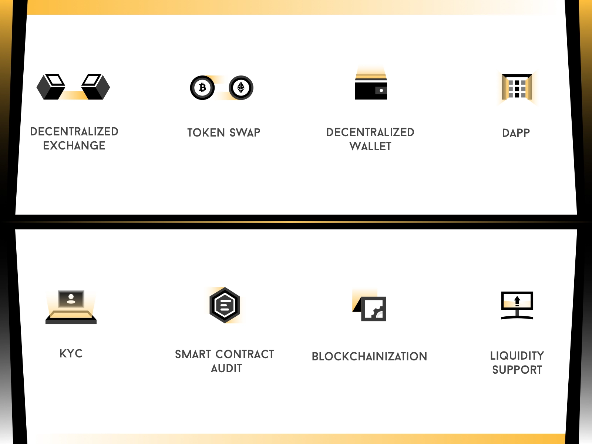

https://blog.makerdao.com/a-brief-history-of-decentralized-finance-defi/

buy DeFi Pulse index; this is an asset; buy it here: https://www.tokensets.com/portfolio/dpi 

read about it here: https://defipulse.com/blog/defi-pulse-index/

learn from https://www.coinbase.com/earn; this covers many of the apps listed in the DeFi List; **VERY IMPORTANT!!! START WITH THIS.**

#### read different consesus mechanisms

review the https://defipulse.com/defi-list; this has all apps/products related to decentralised finance;

watch Superpumped & Bankless vids: https://www.youtube.com/channel/UCi-pkXLbm7sqXFhV1NBLUfQ/videos

#### HACK more smart contracts!

build a dApps; using (things) like InstaDapp & others; these are like libraries or frameworks; jaise abhi ke apps use kar ke bnte h

Learn Web 3.0 for integrating dApps with frontend; confirmed by that one guy on Discord. but true in a general sense. seriously.

everything that a bank does as a central authority(which is mostly taking small money from lots of people & lending it to the needy for high interest rate); DeFi will do that; Return On Investment is higher bcoz there is no middleman; whatever the interest, people pooling the money get all of it minus the network charges, and miner fees

decentralized and distributed are separate terms; distributed me control/power is with ALL the nodes; decentralized me it is with a few nodes(but not all)

there is RISK involved with this too, as with all things in life

always prefer the fully decentralized platform; coinswitch, zebpay, blockfi are still centralized; AAVE, Trezor is fully de-centralized

use metamask for the steps that Richard Garcia does in the staking crypto live stream;

written version of similar things he does is at the https://www.defi.win/zero-to-defi-a-beginners-guide-to-earning-passive-income-via-compound-finance/

# questions?

- when money is pooled in CDP, lenders get a token? or borrowers?

- if the power/control isn't centralized, what's the incentive for these orgs, people who develop these platform/apps?

- the poeple who write these platforms still make the rules? how much control do they still have of the platform?

