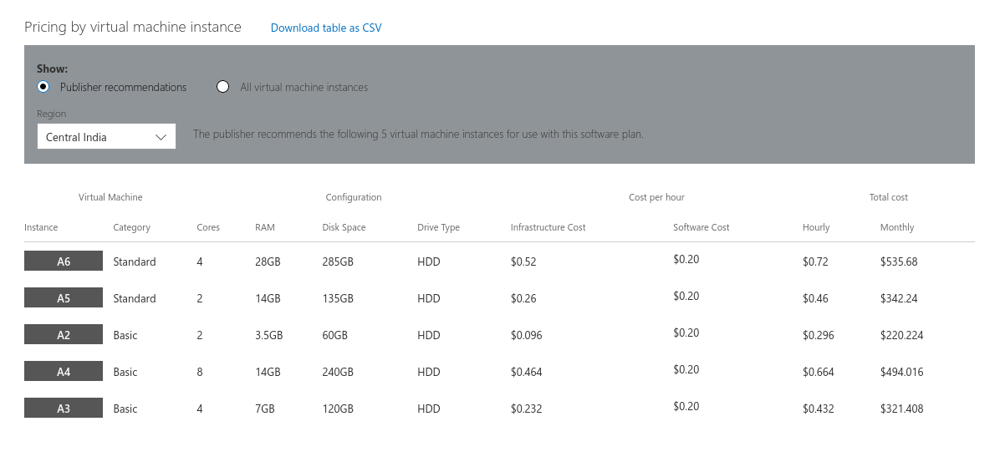

---

soon as i saw a [video on load balancers](https://youtu.be/LlbTSfc4biw) recently, i had this idea of putting up a website on all the hosting providers out there that offer a free plan, put all this up behind a load balancer. 

this way, whenever i want to scale up i won't need to pay for a higher version of the plan for any single hosting. i can just host the website on another free hosting and add it to my load balancer.

yes there would be some extra redirections to reach my website, but it shouldn't be that significant. and if it is, i can use another load balancer in a different region to ensure faster delivery. 

okay, this is starting to get complicated so let's some do some active recon on which servers to take, what load balancer to deploy?

the video already mentions a free forever load balancer Kemp, and so while researching further i found out that AWS marketplace has several offerings with Kemp. so, you're essentially getting a server pre-installed with Kemp, you can log into and setup the ip addresses you want the traffic forwarded to.

I was assuming it would be free on AWS if I use the free tier but the price here is **₹0.90/hr**($0.012/hr). as it turns out load balancing is quite a resource heavy job, and the single free tier AWS server won't cut it.

Kemp is charging for software on Azure, which is why the pricing is higher. primarily because Azure is used by corporations, and that's Kemp makes most of their money

### mathematics required
the amount for the Kemp installed server you'll choose - check how much would you be paying for scaled up hosting fo similar configuration - compare - is it worth long term?

you can try deploying it on a free tier you already own, see how fast that crashes.

### or you can just do it to learn
if you look at anything in the world, this level of convinience is what you pay for. the convinience of setting everything up with minimum hassle, a one-click solution. 

but here, you can do it for learning how everything works, maybe level up some networking skills, SSL certifications, firewall rules, and show off to a bunch off friends, then shut everything down

---

this website is still running on Netlify's CDN and i'm not yet using any load balancers. but you'll never convince me that **₹0.90/hr** is not an amazing pricing to run this experiment.