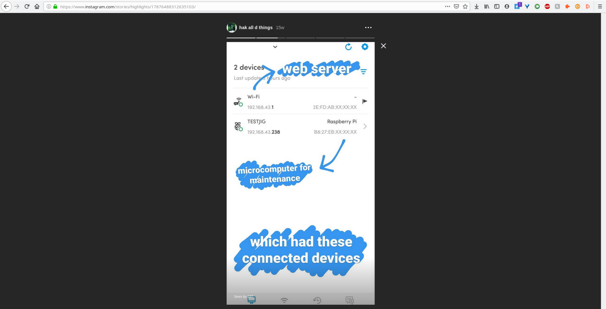
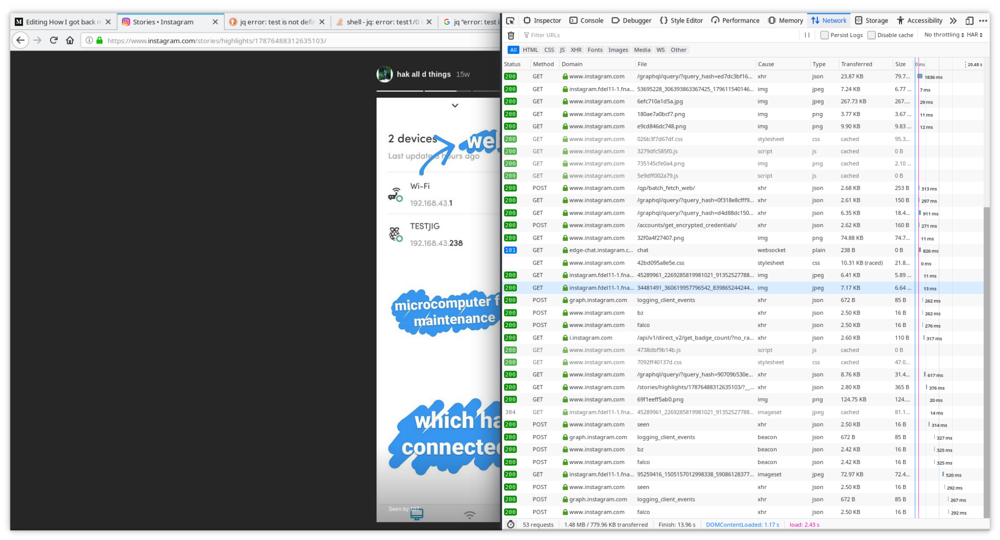
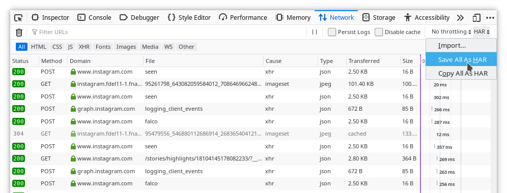
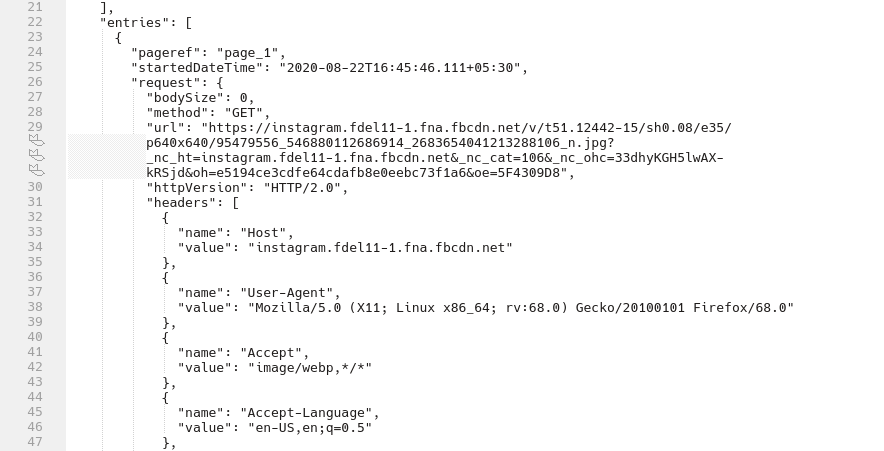
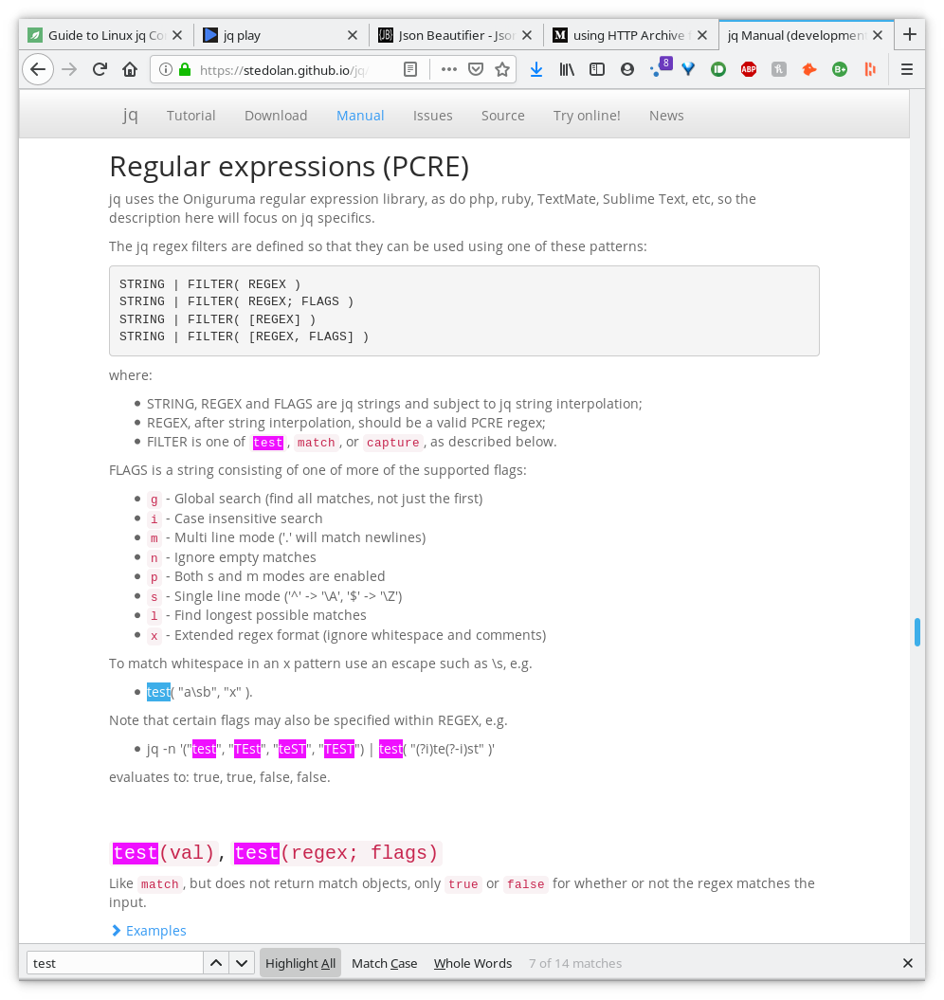
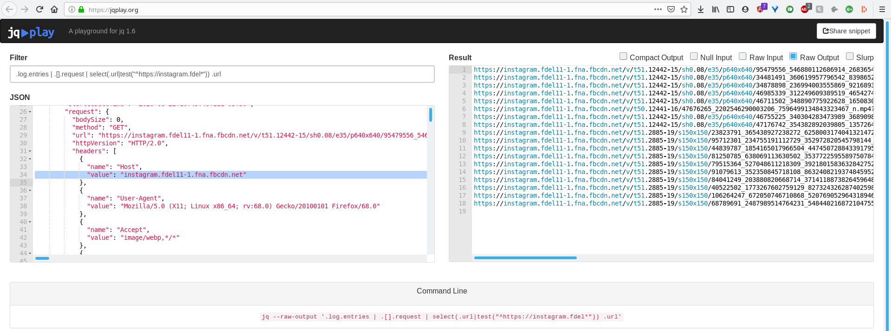

---

The proof of concept images for the vending machine hack were deleted from my phone. How do I get them back? 

---


**August 9, 2020**: I was starting to piece together [my last week’s post], when I opened Google Photos for the images to be included as proof-of-concept. Unfortunately, I couldn’t find them anymore. Then I remembered factory resetting my phone two weeks after the hack, so they must have been wiped. And I do not remember backing them up either. But you saw my last post, and it has those images. How did I get them back?!... Through an HTTP Archive file and some BASH scripting.

I posted few photos of the hack on Instagram stories some 4000 years ago. Luckily, I added them to the profile highlights as well.



Now that they’re stored on Instagram servers, I just need to find a way to get them on my computer since there is no “Save to Device” option in the app menus. I quickly logged in to Instagram web to see if they have the highlights function there and if so, I can get links to those images using *the most amazing piece of hacking software...* the Developers Tools.



I opened the console to see GET requests with the source image request URLs. Awesome! I can download the images now,… but should I? They were NINE images, NINE links to be clicked and saved manually using more clicks. The math is too much! I decided to look for a more automated solution in case there’s ever a need to scale up. Enter HAR.

https://en.wikipedia.org/wiki/HAR_%28file_format%29



This HTTP Archive file, which can be exported from the Networks tab, is a JSON file containing detailed performance data of the browser about the webpage it loads. This would include the image requests URLs I’m interested in. I’ve been looking for a way to collect request URLs like this for ever, and I’ve finally found it during this engagement.



After analyzing the JSON structure, I found which request URL values I need. It’s the one with host as `instagram.fdel11–1.fna.fbcdn.net` I used jq for parsing through this JSON data, all 15,566 lines of it. I thought about using grep or awk or sed but I suppose they would have required a lot more tweaking. Plus I wanted to get better at jq, since I’ve only used it once before.



I spent some time learning how to traverse arrays, creating a regex for finding the URL, also trying to resolve a recurring “error: test is not defined” . Let me know if you managed to solve this because I couldn’t get it working on my terminal. So I resorted to using their online playground for testing... A one-line bash command for extracting direct image URLs from the HAR file. And another one to download them.



At this point I had everything I needed, complete with a bash script to go over the URLs, and download the images using wget. Because everything looks cool in script?! Take a look for your experimental pleasures :p

```bash
# extract URLs and store in highlights.txt
jq --raw-output '.log.entries | .[].request | select(.url|test("^https://instagram.fdel*")) .url' stories.har > highlights.txt
# download all
while IFS= read -r line; do wget $line; done < highlights.txt
```
This is an example of how problem solving works in the real world. Taking existing random knowledge bits, sometimes learning new bits as well and connecting them in a clever way to get results. [Read my last week’s post] where I used these images for proof of concept.