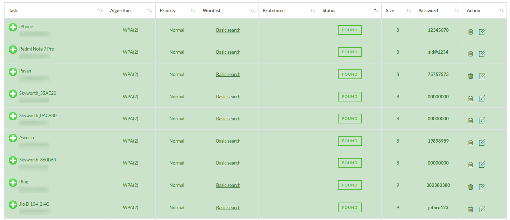

---

title: "Wireless (In)security in Delhi NCR"
slug: "/wireless-insecurity-delhi-ncr"
excerpt: "my experiments with the pwnagotchi project"
date: 2023-09-27
tags:
    - Wi-Fi
    - pwnagotchi
    - raspberry pi
    - Delhi
    - NOIDA
canonicalUrl: "https://blog-about-normal-text.com"
---


I heard about the pwnagotchi project from [Alex Lynd while he was on Hackster Café podcast](https://www.youtube.com/live/P_XftmStKvc). And it immediately fascinated me. After some research and convincing myself to purchase a ₹414($5) Rspberry Pi Zero W for ₹1499($18, global chip shortage still persisting in June 2023), I started [reading more](https://www.evilsocket.net/2019/10/19/Weaponizing-and-Gamifying-AI-for-WiFi-Hacking-Presenting-Pwnagotchi-1-0-0/) about the creation of this extremely awesome mix of software & hardware project. 

As I read, I found the AI(to improve packet capture) and cryptographic keys(for identity & secure communication with other units) to be worth exploring. Here I make my best effort to document my time with the device and eventually draw some conclusions of the Wi-Fi security practices of Delhi and non-capitalized regions surrounding this 9000 AQI capital city.

For those not familiar, a pwnagotchi device is essentially [bettercap](https://www.bettercap.org/) installed on a Pi Zero, allowing to capture Wi-Fi packets on the go. The captured Wi-Fi packets can be automatically uploaded to third-party services, and then analysed to reveal weak wireless passwords (PSKs) of the nearby wireless access points.

The pwnagotchi device I was carrying around in my backpack looked like this:


While I spent a week walking around, the pwnagotchi device was attempting to capturing wireless handshakes nearby to identify wireless networks with weak pre-shared keys. **My goal was to see how Wi-Fi owners fell short in 2023 when it comes to network security.**

## Installation

Unfortunately, the pwnagotchi project didn’t receive too much TLC recently as the main developer, evilsocket, moved on to other projects. I tried the official pwnagotchi release first, but I later realized the AI model doesn't start because of a numpy error and fixing it got pretty annoying.

In the end, I chose the [**wpa-2/pwnagotchi**](https://github.com/wpa-2/pwnagotchi) fork, which is the closest to the original evilsocket/pwnagotchi repository. Although both of them are not being actively developed, the ‘wpa-2’ fork has the numpy patch for AI, so I ended up using this one. 

For the basic pwnagotchi installation and configuration, [they are well covered on the official website](https://pwnagotchi.ai/installation/). Instead of repeating the installation steps, I am going to share how I use it in the following sections.

## Bug Fixes

First, I tried to run an ‘apt update’, but it kept crashing the device and I had to restart it by replugging. I suspect the command might be crashing the device, although I haven't seen this issue on any of the forums.

### Timekeeping(TO DO)

The Pi Zero does not come with an onboard hardware clock, although this does not affect its ability to capture handshakes. But to prevent the internal clock go out of sync, I can either use the recommended [RTC hardware module for the Pi Zero](https://pwnagotchi.ai/installation/#hardware-clock), or install a lightweight Chrony NTP daemon to keep the clock accurate:

```apt install -y chrony```

And then, change the default timezone to my local one:

```timedatectl set-timezone Asia/Kolkata```

### Swap File

As the pwnagotchi tend to use a large amount of memory, I found the default swap file can be given more room to breathe. To enlarge the swap space, I changed **CONF_SWAPSIZE** parameter to 500 megabytes in the ```/etc/dphys-swapfile``` file to keep the system happy.

```CONF_SWAPSIZE=500```

This setting requires the pwnagotchi to restart to take effect.

### Bettercap

When the pwnagotchi is booted in Manual mode, the [Bettercap Web UI becomes available](https://pwnagotchi.ai/usage/#bettercap-s-web-ui) on port 80. The bettercap UI allows to monitor events, although I never ended up using it.


### Remote Access

There are two ways to connect to the pwnagotchi over a network:

    - [through the micro-USB cable](https://pwnagotchi.ai/configuration/#connect-to-your-pwnagotchi); or
    - via Bluetooth tethering.

In the first case, the Pi Zero is connected to a PC over USB such as a laptop. This scenario allows simple SSH access from the laptop to the Pi Zero over USB-over-Ethernet. Obviously, this makes it difficult to carry the pwnagotchi around, as the cable needs to be connected to a clunky device.

As for the Bluetooth option, the pwnagotchi can access the internet while it is powered by a power bank. And I can use an SSH client on my phone to access both the shell and the dashboard using a very clever Bluetooth Network Encapsulation Protocol (BNEP).

I absolutely loved the latter method of access, mainly because it felt more hacker-y. 


As mentioned in the [Known problems for bluetooth](https://pwnagotchi.ai/configuration/#known-problems), I had to manually pair it with my phone the first time. And it connects automatically everytime after that, but keeps disconnecting & reconnecting a few times in between sessions.

### Hardware Temperature

On a related note, it is worthwhile monitoring the hardware temperature when the pwnagotchi is stuffed away in a backpack, as the Pi Zero tends to get hot in poorly-ventilated areas. The temperature value is also available from the command-line over SSH:

```/opt/vc/bin/vcgencmd measure_temp```

### GPS issues(IN PROGRESS)

Only the net-pos plugin seem to be working as of now, and updates the same location for a handful of handshakes, but enough to get the nice banner for this post.

## PSK Auditing Plugins

The pwnagotchi comes with a [myriad of plugins](https://pwnagotchi.ai/plugins/) of varying quality. The two most important ones I found to enable are [wpa-sec](https://wpa-sec.stanev.org/) and [OnlineHashCrack](https://www.onlinehashcrack.com/). The pwnagotchi can automatically upload the captured handshakes to these two online Wi-Fi handshake auditing services. If the Wi-Fi passphrase is simple enough, these two online services can reveal the wireless password within 24 hours.

If you don't like GUI, enable the password-auditing plugins with the following:

```pwnagotchi plugins enable onlinehashcrack```

```pwnagotchi plugins enable wpa-sec```

OnlineHashCrack does not require a user account, but it still needs a valid email address to upload and the handshakes. You will need to enter this email address on OnlineHashCrack.com to access the results.

Add an email address by running:

```pwnagotchi plugins edit onlinehashcrack```

Then your preferred email address should be added to the **main.plugins.onlinehashcrack.email** setting.

Similarly, wpa-sec requires an API key (obtained from [here](https://wpa-sec.stanev.org/?get_key)) to be added to **main.plugins.wpa-sec.api_key**:

```pwnagotchi plugins edit wpa-sec```

The Wi-Fi pre-shared key auditing results will be available at once the pwnagotchi starts uploading them:

    - https://www.onlinehashcrack.com/dashboard
    - https://wpa-sec.stanev.org/?my_nets


## Hash-Cracking using Cloud GPUs

The Wi-Fi handshakes are also available in **/root/handshakes** on the pwnagotchi device for offline cracking with the hashcat toolkit.

### Using Genesis Cloud
I procured a server in Norway with GPU access using [Genesis Cloud](https://gnsiscld.co/u1jgwp). I wanted try cracking passwords using hashcat because I had never done so before. It took a while to get something with attached GPU, since cloud providers everywhere are limiting access to GPU servers. Everyone's trying to do something with AI, [including me](https://example.com). GPUs being used for both AI and crypto shenanigans. NVIDIA stocks booming. 

I requested for a quota with Genesis Cloud and got approval for 2 GPUs. Experimented with a bunch of options in hashcat and quickly realized how setting a long and complex password significantly increases the time required to finish the brute-force. 


## The Results

After a month of roaming around parts of NOIDA & Delhi, the little pwnagotchi managed to collect Wi-Fi handshakes from **428** different wireless access points. Due to various networking issues, about **##** handshakes were submitted to the [OnlineHashCrack](https://www.onlinehashcrack.com/) and [wpa-sec](https://wpa-sec.stanev.org/) handshake-auditor services.


In the end, the two online services found **## Wi-Fi access points with easily-guessable wireless passwords** around the area.

Having seen the ## weak passwords and their corresponding access points, I managed to draw the following conclusions:

    - Disable the insecure Wi-Fi Protected Setup (WPS) feature on your router. The 8-digit-long numbers-only passwords take mere seconds. (## wireless APs)
    - If you have a pocket router, or use the personal hotspot feature on your phone, choose a strong password. (# APs)
    - If you have a POS machine for your restaurant business, ensure your private Wi-Fi is protected with a strong password. (# APs)
    - If you have a wireless access point for your office PCs, ensure it is either protected with a strong password or it relies on PKI-based authentication. (# APs)
    - If you are a wealthy individual, ensure your AP name is not named after yourself and your wireless password is not easily guessable. (# AP)





## Conclusion

Although Wi-Fi security is a well-researched, well-understood and over-communicated area, individuals and businesses both seem to configure Wi-Fi networks as it was still the early 2000s(not that I know how it was at that time).

Without boring anyone to death by stating the obvious: WEP, WPA, weak PSKs are bad, while **WPA2, WPA3 and strong passwords rule**.

To secure your Wi-Fi networks, my practical advice is:

    - Choose a strong password to protect your wireless network;
    - Use WPA3 if available, and choose WPA3-compatible routers and devices;
    - Use certificate-based wireless authentication if available;
    - Disable the Wi-Fi Protected Setup (WPS) feature on your router;
    - Randomly name your wireless access points to hide their purpose (e.g. networks for Point-of-Sale systems);
    - Hire a professional to secure your network if these things look complicated to you.

As for the pwnagotchi, [it is still a fun project to tinker with despite the recent inactivity](https://www.reddit.com/r/pwnagotchi/) around its development. Once the small bug fixes are applied, the pwnagotchi just simply does its job as intended, while making the cutest faces.


