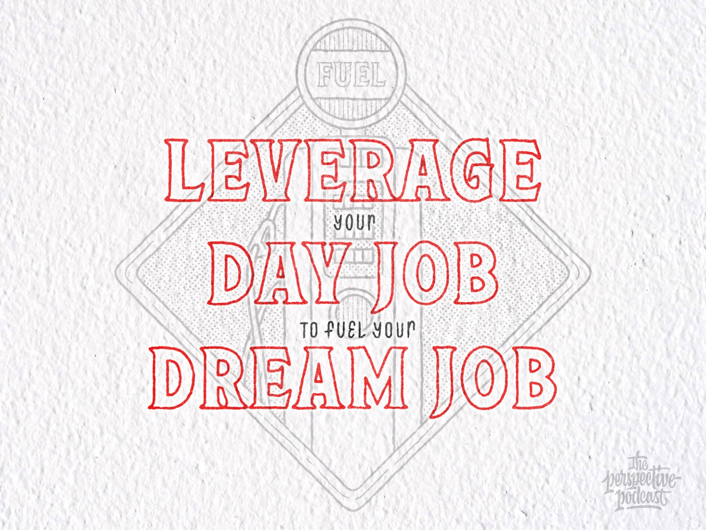

# one
#### avoid using inputs which are less egaliatarian 
labour / people & capital

#### what is more egalitarian?
code / media - build products on these for ethical wealth creation

----
# two
rolex watches for signalling value - zero sum game

- **>be here< (in the middle)**

netlfix/youtube for everyone - positive sum game

---
# three
#### tech has amortized cost of production
capital & human labour has reduced in food production - more tech oriented now

**example:** jeff bezos is not eating better food - just different food with human touch - theatrically presented

---

# four
#### create wealth ethically using technology/code/media as leverage
equally available for everybody - better scale economy - used more by people - large budget - user additon has no cost - higher quality? - use budget to create more quality

------

# five
> wealthy people use money on signalling goods to show wealth and play the status game, not actually consuming the goods for benefit

- people & capital -ve externality
- code & product +ve externality

**permissioned / permissionless**

- community - diffused form of labour - ex: facebook
- capital & labour becoming permissionless

> rich people price up things so only they can have them, hence the value remains... 

> as an individual, can you bring the value down so everyone can have it? should everyone have it? what would happen then? how can YOU do this?