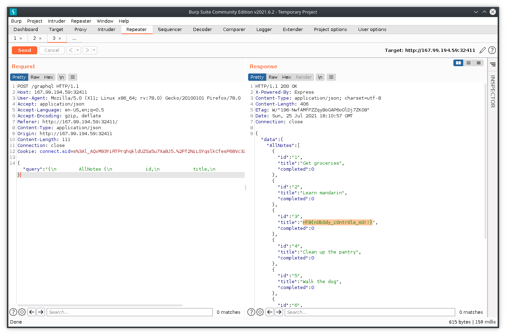

---

# Challenge Description

I don't think that replacing your REST APIs means that you don't need access controls. Can you read the admin's tasks from this minimal note taking application?

# The way I did it

##### 1. Open the IP ADDRESS:PORT in your browser to find the fastest note-taking experience on planet earth(atleast of all the apps I've used).

Seriously, you can just keep typing and ENTER-ing to build up the list. I have so many use cases for this kind of functionality. Maybe I can build one like that, or get the backend code from HTB?

##### 2. Interact with the app by entering notes in the input to add. Complete & Delete notes to notice the note you delete is number 6.

IMPORTANT STEP, try the application from a user's perspective before you hack anything. You need to know what you can OR cannot do with the app, and then make it do what you want.

##### 3. Find the POST request to /graphql in Dev Tools that is constantly updating & fetching your list.

Initially, I changed the request method to GET to try and fetch all notes, and here's where the differences lies, the HTTP request method does not control how you're interacting with the GraphQL... database... thing(I don't know the word for it, DM if you know!). There's `query` & `mutation` in GraphQL that reads and write OR make changes in the database.

##### 4. Use Burp or Mozilla's Edit and Resend to modify "MyNotes" inside the body to "AllNotes". Honestly, I just thought that's how people write code.

A better way is to run an [Introspection Query](https://gist.github.com/craigbeck/b90915d49fda19d5b2b17ead14dcd6da) it is the equivalent of DESC command in SQL, and describes the schema of graph which is storing notes.

But that query has a lot of stuff that is too much for me(begginer in GraphQL). So, here's what you can query when you just want to know what queries are supported and subfields you can query for:

```

{
    __schema {
        types {
            name
            fields {
                name
            }
        }
    }
}

```

Here AllNotes immediately catches my eye, which is of type Post with same subfields as MyNotes.

##### 5. You'll get all notes stored on the app. Flag at the third position.



There is a Burp extension([InQL](https://github.com/portswigger/inql)) that make life easier, fetching all the queries which are supported, very similar to the query in the previous step. But I'll surely be playing around with that Introspection Query on more GraphQL implementations to understand how everything works.
