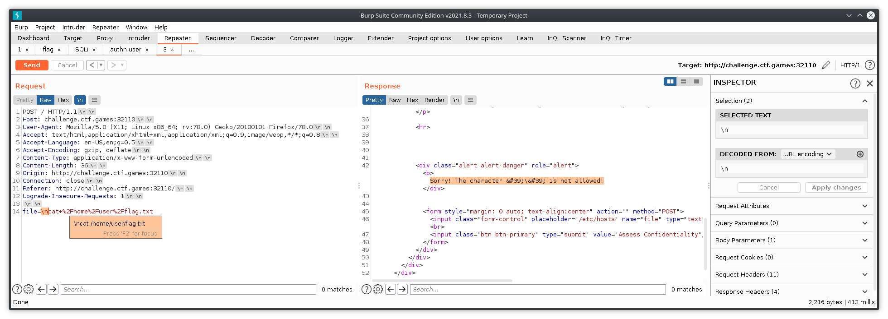
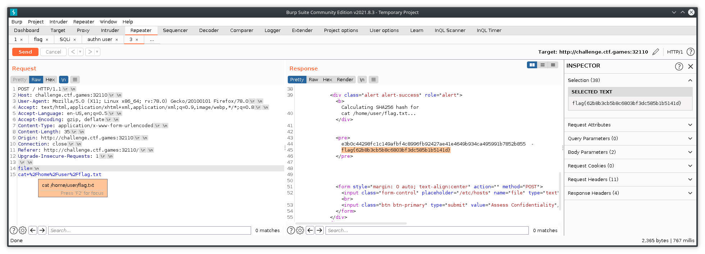
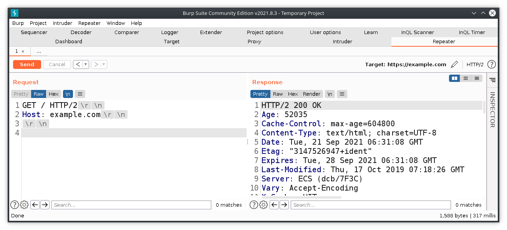

---

### attempt ALL the challenges, read ALL the writeups

1. even if the challenge label says "hard", try it out - after the CTF ends and you're reading writeups, **it'll be a huge help** - it's so much easier if you already have browsed the challenge. and yes ofcourse, you absolutely should read all write ups. 

2. **it's just a label** - and they don't always apply to your level of expertise - **OPA Secrets**, "hard" challenge - a [writeup mentioned it as code audit challenge](https://github.com/todd-tao/CTF-WriteUps/tree/main/H%40cktivityCon_2021_CTF/Web#solution-2) - before reading any further, i started the challenge, browsed around to find the source on GitHub, to find the flag's ```id``` hard-coded, i then modified the ```/getValue``` POST request with that ```id```, and got the flag - later in the writeup, it says access control was not implemented - which was the actual vulnerability, but all i needed was to send a request with ```id``` in the body to get the flag, and the ```id``` was  in the source; point being, it's hard only if you don't know how to read code.

3. in a broader sense, while attacking apps in the real world - you have to try anything & everything that comes to mind, never assume it won't yield results bcoz it's too easy OR simple - **always assume you're the first person looking at it** - it's the real world, it's common for anything to get overlooked. 

4. **fastest way to get an idea on new domains** - recently i read a bunch of writeups on some cloud challenges, and it certainly helped with the tools (what?)and methods(how?) for a super fast practical start.

### brute-force all the things
admin:admin - that's the solution to another "easy" web challenge, **swagger** - why do i keep brute-force as the last resort & then completely forget about it.


### extract text from image, fast!!!
i'm looking at you, "easy" warmup challenge **pimple** - used Google Lens on phone to scan the image > copy flag text > send to laptop via Pushbullet OR just use an online OCR website like a normal human being, how come i did not think of that during the the CTF?


### browsing the dark web
**Mike Shallot**, OSINT - first challenge i encountered which required me to explore the dark corners of the internet - and now it's so much easier to connect to Tor network with the Brave Browser's Private with Tor feature - i did try installing Tor at first, but there were some errors - plus i had Brave already installed so i thought i'll try the feature this time - surprisingly, this browser doesn't even need admin rights for installation(i should research on the how) - it blocks ads & trackers by default, and you get Basic Attention Tokens just for using the browser - which you can send directly to favorite creators on the internet - try sending me some right here from this website - [crypto supercharges the great online game](https://www.notboring.co/p/the-great-online-game) - i realize i sound sponsored right now, i'm not. 


### \n is the not newline character
**integrity**, "medium" web, had filters for few characters, i tried a few including '\n', and got the error: '\' is not allowed



later a writeup did the exact same thing and i couldn't understand the difference - until i played around in burpsuite and copy-pasted the newline character i got from the non-printable chars 



NewLine (\n) is 10 (0xA) and CarriageReturn (\r) is 13 (0xD) - in other words, \n is the printable version(?) somebody correct me on this, please!



to read more on this, here's [an old non-HTTPS blog from 2009](http://hayne.net/MacDev/Notes/unixFAQ.html#endOfLine) and [a modern day Q&A website](https://stackoverflow.com/questions/3267311/what-is-newline-character-n).


### SSTV - Slow Scan Television
https://www.sigidwiki.com/wiki/Slow-Scan_Television_(SSTV)

### pastebin for code leaks, also employee GitHub repos

