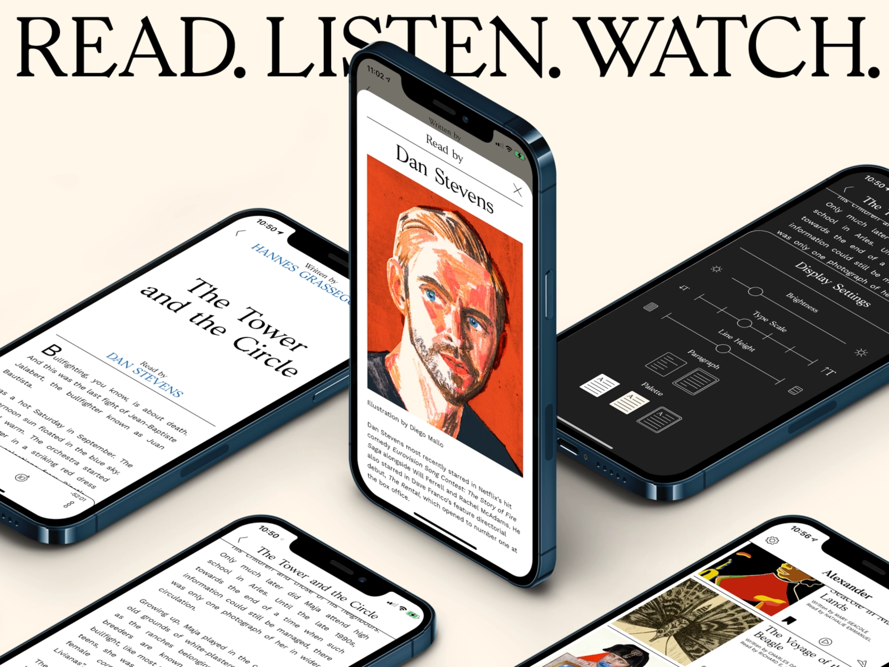

# The Biggest Myth in Education
-----------------------------
for the longest time i only had [this scoopwhoop article](https://www.scoopwhoop.com/subtle-art-of-not-giving-a-fck-quotes/) on [The Subtle Art Of Not Giving A F*ck](), until a friend of mine gifted me a physical copy, saying everyone should have their own copy of this.

refer [veritasium's education myth vid](https://youtu.be/rhgwIhB58PA) - write your own summaries on medium on your own blog - or send it to me - i can include it here on the website - watch book summary vids

but in moderation - bcoz after 4 vids you don't know where you'll end up

not just that - write summaries for learning through writing - explain to others for learning through speaking - if that's your thing

point being learn from all kinds of format - you're not a single kind of learner

# How I Read Books ?
--------------------

##### **morning** - the free blink of the day (whilst preparing breakfast)
##### **afternoon or night** - physical books (i always have 2 open books at all times, recent experimentation)
##### **audible** - while cooking OR cleaning (doing tasks around the house)
