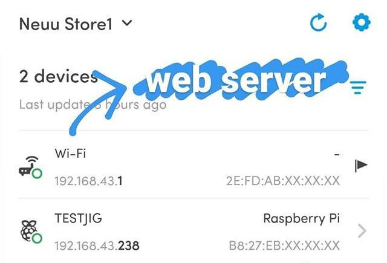

---

May 3rd 2020 “Lockdown Day 40” in Gachibowli, Hyderabad. After dinner, while walking around the campus I saw a vending machine connected to a wireless hotspot. This is how every IoT hack begins.

---

## Where’s the Wi-Fi?!

The vending machine is quite standard, but made “smart” by attaching an android tablet for doing things like accept cashless payment and sending telemetry data. The original inputs are disabled so we can ignore those for this writing. The tablet is running a shopping cart app which keeps inventory of the items and the other stuff I mentioned before. All this while being on a wireless hotspot created by the tablet itself.

## Yay! No MAC filters!

Getting out of the app was simple with the usual android gestures. After that I went into the Settings app, got the name of the hotspot and password, successfully connected my phone to it and…

Did a quick scan of the network with Fing(like I usually do whenever I connect to a network) to get the Wi-Fi(which is the tablet acting as a router) and a Raspberry Pi to control the vending machine.

## NEW PHONE, NO AUTH!?

Running a port scan on dot1 tells me that port 8080 is open and when I access it from a browser... I get an Android Debug Database page showing me all kinds of information without performing any authentication.

## The “No Security by Default” Database

A quick google search pointed me to its GitHub repository, which says this database GUI directly interacts with shared preferences of the android environment. Awesome! So, it’s not only fetching data from the memory used by the android app... but I can add or delete stuff too, COMPLETE ACCESS to the database. More specifically...

And as for the Raspberry Pi from earlier, it is running SSH and VNC server on default ports for remote access, viewing sales analytics and managing the device remotely. Both password-protected, which I can have brute forced but it’s a good enough security measure to stop me from cracking it at 12:08 AM.

---

Internet of Things exists now, and so, basic access control mechanisms and authentication measures must be baked into the application software of these vending machines and other smart home devices, and also turned on by default during setup. This can prevent just about anyone from not only getting into your “smart” fridge and knowing how much yogurt you can consume in a day, but also move to other devices and [go full-on Mr Robot](https://youtu.be/aAj8zHOEfiI) on your smart home.

---

The photos I originally took during this hack were deleted. Check my next post below to know how I got them back from Instagram servers.