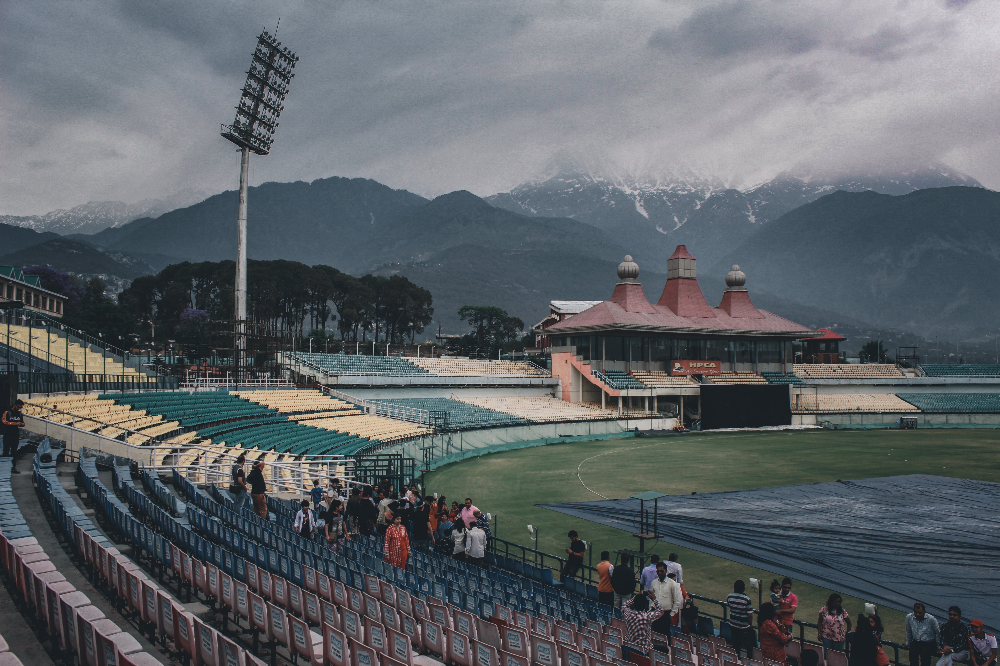

travel planning for the uninitiated, solo beginners wanting to travel slow, or luxuriosly if that floats your cruise; or maybe you're the friend in a group who's always saying "let's go somewhere" but never plans, take all the offence you want to, and then read this article. let us begin.

10:00 AM IST / 6,900 FEET OVER HIMACHAL PRADESH

(TODO: intro from the hotel room when i reach himachal pradesh)

> 4 years, 17 cities 

Having travelled solo to the hills for the first time ever just for the sake of travelling, I want to provide some value to the people who have the means to travel but don't. These are pointers on how to best go about planning your destination travel, or possible world tour.  Tried and tested by me, a 26yo who spent most of 2021 in alone in some 3BHK in Hyderabad, doing a self-imposed silent retreat(not the topic of this article).

the following will be steps you can take right now, to convert your travel thoughts to actual bookings and eventual reality - the reason we don't plan our travels to completion - everything will be actionable advice and the recurring theme you'll notice is that we're trying to ground our thoughts for each aspect of travel

first and foremost, and i cannot stress this enough - you NEED to apply your brains - nothing is going to happen on its own - but also you don't have to do everything - it's like the universe doesn't conspire against you, but it doesn't go out of its way to line up all the pins either - conditions are never perfect - so if it's important to you and you want to do it "eventually", just do it and correct course along the way. 

whenever you hear about a new place in a movie, TV or a reel(oh how the times have changed!) -

> google calendar research time event, with funny title

1. **set a calendar event to research** - Even 30 minutes are sufficient(snowballing will take care of the rest) - yes we want to schedule time for this so we don't just end up doomscrolling instagram the whole time, consuming over glamourized travel reels

2. search on Maps and **look at where places actually are on a map** - you will get to know how far it is, and available modes of transport to get there - and it won't change. ever - congratulations! you are now 1 fact closer towards realizing your plan

3. **check distances** - you see all these stories from everyone around the world - wondering how people visit so many places in such short times - again, check distances on maps - most tourist places actually exist in clusters - wherever you choose to stay, there are 10000 places within spitting distances - food, temples, treks, beaches, markets, libraries or whatever you fancy - it is the usual environment where people live & breathe - although booking away from popular spots helps save you money, this is not that kind of article

4. **watch the routes** - maybe even visualize yourself walking on the streets, through the markets, trekking in the forests - people getting on with their daily routine - this is purely psychological - and you will feel it's easier to plan - not as difficult as "scaling a mountain", no pun intented. 

5. **check the costs** - Time, Money, Attention - you don't have to book right away - but checking prices around some dates - help us ground ourselves with an estimate of the money we'll need - the duration of travels - flights, buses, trains. the costs of stay in hotels or hostel rooms. which activities you absolutely want to participate in, and which you can ignore. 

6. **calculate money cost of living** - before you do this, you must figure out what your average monthly expenses are - start to track your spends to get an idea(I reccommend [ETMoney's Spends Tracker](https://play.google.com/store/apps/details?id=com.smartspends) or [GoodBudget](https://play.google.com/store/apps/details?id=com.dayspringtech.envelopes)) - so you can get a sense of cost of living in the place you're travelling to. but in general too - tracking your spends, and budgeting is a good habit - and helps in the long run with everything else.

7. **call the accompanying contacts** from the accomodations and talk to them - tell them a tentative date - and discuss costs & options, just for research purposes - hearing from people actually living there and telling you insider knowledge, you will realize it's not as difficult as our minds make it.

8. when choosing train/bus/flight bookings, **use as many filters as you can** - to avoid the paradox of choice(AKA choice paralysis)- less options are more easier to choose from - apply filters for things you can easily decide on - the pickup/drop point, departure/arrival time, evenings/mornings arrival/departure - sort for less duration or prices - this is to narrow things down and remove noise. Eliminating choices. Giving yourself fewer options.

> filters image redbus 

9. **how to figure out routes for bus booking/planning locations to visit?** - use Google Maps's "Add Destination" feature - add a bunch of locations you want to visit - it shows the distance and time from one to another - reorder and create a route that works for you - i like to minimize the total time i spend sitting in transport vehicles so i have more time to explore the place, not the insides of cabs and bus - (although this can be avoided if you're travelling in a group, because you don't want to be the person who optimizes friendly hangout time, that is if you do not want to thrown out of the moving bus) - i absolutely love minimizing travel time by deciding on a skeletal route - and it does help a lot when you travel, it's one less thing you have to worry about. 

not that everything will ever go according to the plan, but we have to plan for the plan not going according to the plan(it's from a book i don't remember right now) - and whenever you do decide to wing it - being vocal with locals is still works.

